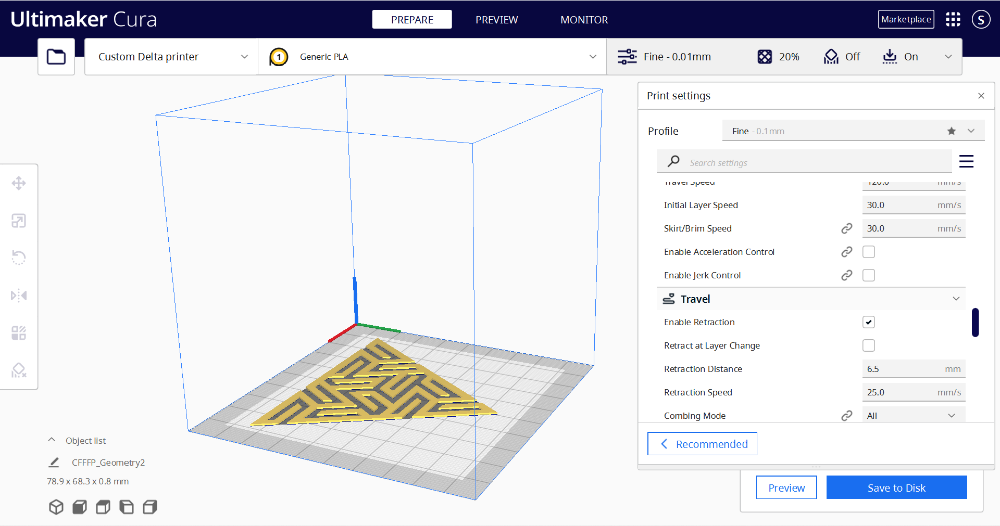

# 3D-printeing-of-Triangular-Geometry
3D printeing of Triangular Geometry in PLA, and  the simulating of its proccessing in Cura by tuning parameters.

### SET-UP
#### Printer: Ping EDU
#### Print settings:
- X(Width): 200.0 mm
- Y(Depth): 200.0 mm
- Z(Height): 200.0 mm
- Build plate shape: Elliptic
- Origin at center: true
- Heated bed: false
- Heated build volume: false
- G-code flavor: Marlin

#### Printhead Setting
- X min: -20 mm
- Y min: -10 mm
- X max: 10 mm
- Y max: 10 mm
- Gantry Height: 200 mm
- Number of extruder: 1
- Apply offsets to GCode: true

| Start GCode  | End GCode               |
| ------------ | ----------------------- |
| - G28 ;Home  | - M104 S0               |
| - G92 E0     | - M140 S0               |
| - G1 F200 E3 | - ;Retract the filament |
| - G92 E0     | G92 E1                  |
|              | G1 E-1 F300             |
|              | G28 X0 Y0               |
|              | M84                     |

> The ***G1*** command tells your printer to move in a straight line to the location that you specify. ***G28*** is used to zero return the tool to its zero position via a reference point at rapid speed, and ***G92*** command specifies the current location of the nozzle. ***M104*** sets a new target hot end temperature and continue without waiting, while ***M140*** sets a new target temperature for the heated bed. ***M84*** command can be used to set the stepper inactivity timeout (S) or to disable one or more steppers (X,Y,Z,E).

- Triangular Geometry in cura

### REPORT
#### Pre-printing
The 3D printing process takes 1 hour and 47 minutes and uses 10 grams and 3.47  of PLA filament.
Before printing, some parameters are adjusted to reduce the time required.:
1. Infill pattern set to Grid
2. Build plate adhesion set to aft
3. Set Layer Height to 0.05 mm in Quality
4. Tune Wall/ Thickness to 0.8 mm
5. Set Initial Speed to 30 mm/s and Print Speed to 60 mm/s

#### Printing result

- Result of Triangular Geometry

#### Evaluation
##### Problems:
- Material clogging in the extrusion head due to preheating.
- Low adhesion between different layers.
- It is not easy to demould.

##### Solutions:
- After compressing the spring, take out the PLA wire and sharpen its front end to ensure smooth discharge.
- Adjust the initial speed, and increase the printing speed after confirming that the first few layers are indeed sealed.
- Slowly cut the base with a planer.

#### Conclusion
It is impressive for the complex design and smooth process in the implementation of 3D printer artifact practice. The degrees of freedom also offer the possibility to develop creativity between the layers of materials and various printing paths. By simulating the materials, qualities of and process The works in Cura, it could be insured the manufacturing of the design from the CAD into CAM with integration through the iterations and examinations.

